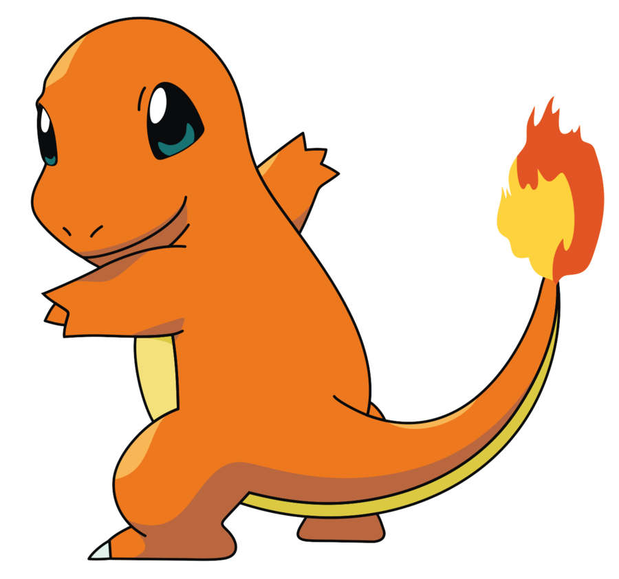
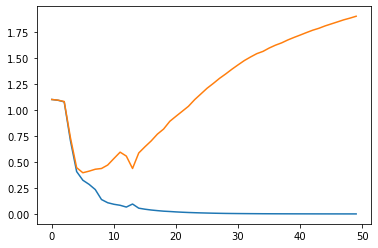

# Pokemon Image Classifier

The goal of this project is to create a model that predicts the type of pokemon from an image. I will be using Pytorch to implement a convolutional neural network and will be investigating the misclassifications. 

## The data

The data is from https://www.kaggle.com/kvpratama/pokemon-images-dataset. This user has generously provided a dataset of images of pokemon, however I am only using 3 types for classification. This is mainly because they have over 200 images available each, whereas most others have about 20-30, which may be insufficient for image classification. The pokemon I am using are Bulbasaur, Charamnder and Squirtle, shown below. After downloading the dataset I had to rename all of the files for convenience and filter out any images that we not good enough. Some images contained multiple pokemon, too many background items or had variations that were too different from a normal version. I labelled them and sorted split them into test and train data.

Bulbasaur

Charmander

Squirtle

## The model

I am using a CNN with a feature extractor that takes in a 100x100 resolution image and produces 64 feature maps. The classifier part of the network flattens the feature maps, passes them through a multlayer perceptron and outputs a probability distribution for the 3 types of pokemon. The number of nodes and layers were determined through trial and error using other well known classifiers as a rough guide. Below is a plot of the number of training iterations (per 100) against the cross-entropy loss of the training set (blue line) and the test set (orange line).

There is a huge gap between the loss of the training and test set, which means that there is a high varience and the model is overfitting to the test data. However despite a large of loss value the actual accuracy of the model after 5000 steps is 87.78%. This seems counter intuative but it means that the misclassifications are very significant and the probabilities are not even close to the desired values. In other words if it gets an image wrong, it gets it very wrong, which is not great. In an attempt to reduce overfitting, I tried to use less training loops. After some experimentation, the best value I could get was 90% accuracy with 4000 steps. The next step would be to try a less complex model, but it seems likely that I would need more data to produce better results.
